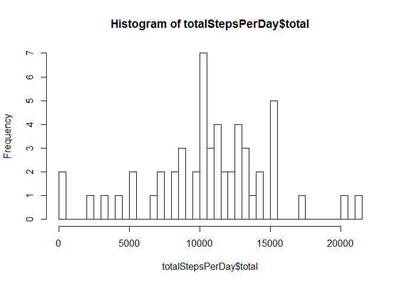
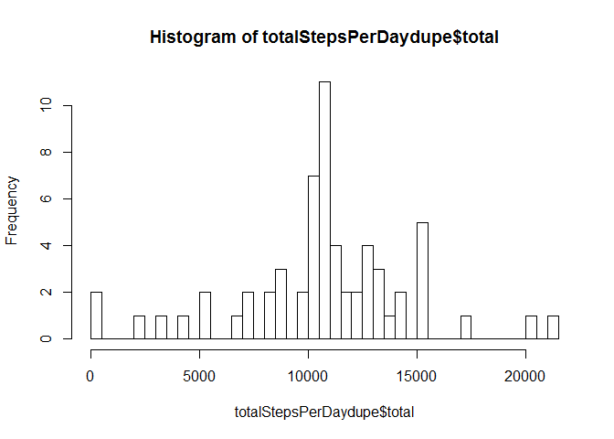
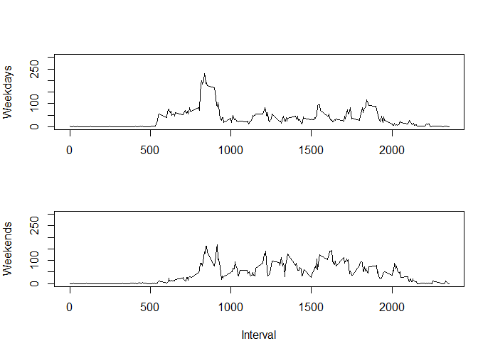

Peer Assignment 1 for Reproducible Research Course  
Author: Ajith Sasikumar  
Date: 12/18/2015

#Activity Monitoring Data Analysis

Additional Libraries used in the analyis

```r
library(dplyr)
```


First step is to download the file into the working directory, unzip it and load it into the object **activity**. The code is setup to work for https links on windows machines. setInteruse() function is used to use the Internet Explorer to download from https servers. 


```r
url<-"https://d396qusza40orc.cloudfront.net/repdata%2Fdata%2Factivity.zip"
setInternet2(use = TRUE)
download.file(url,destfile = "./activity.zip")
unzip("./activity.zip")
activity<-read.csv("./activity.csv")
```


##What is the mean total number of steps taken per day?

First calculate the total number of steps taken per day.

```r
activityNoMissing<-filter(activity,!is.na(steps))
by_date<-group_by(activityNoMissing,date)
totalStepsPerDay<- summarise(by_date,total=sum(steps))
```
Let us create the histogram for the steps variable  

```r
hist(totalStepsPerDay$total,breaks=50)
```

 
Let us now summarize to get the mean and median of total number of steps in a day


```r
totalStepsNoMissingMeanMed<-c(mean=mean(totalStepsPerDay$total),median=median(totalStepsPerDay$total))
totalStepsNoMissingMeanMed
```

```
##     mean   median 
## 10766.19 10765.00
```
##What is the average daily activity pattern

Using the subset of activity dataset with no missing values, we first do a group by on interval.  
Then summarise this dataset using the mean function to calcualte average.  
Finally plot the average steps per Interval across all days against the interval values.  


```r
by_interval <- group_by(activityNoMissing,interval)
avgStepsPerInterval<-summarise(by_interval,avg=mean(steps))
plot(avgStepsPerInterval$interval,avgStepsPerInterval$avg,type="l")
```

 

##Imputing Mising Values

Calculate the total number of rows with missing values


```r
activityMissing<- filter(activity,is.na(steps)|is.na(date)|is.na(interval))
numberOfRowsMissingData<-dim(activityMissing)[1]
numberOfRowsMissingData
```

```
## [1] 2304
```
To impute missing values, steps listed below are done  
1.Create a duplicate of the activity dataset   
2.Check for missing values in the Steps column in Activity dataset for each row  
3. If a value is NA, then assign the value of average steps per day for that interval.  


```r
activitydupe<-activity
rowcount <- dim(activitydupe)[1]
for( i in 1:rowcount)
{
  if( is.na(activitydupe[i,1]))
  {
    indexinterval<-which(avgStepsPerInterval$interval==activitydupe[i,3])
    
    activitydupe[i,1]<- avgStepsPerInterval[indexinterval,2]
  }
}
```
A histogram of the total number of steps taken per day is plotted.  


```r
by_datedupe<-group_by(activitydupe,date)
totalStepsPerDaydupe<-summarise(by_datedupe,total=sum(steps))
hist(totalStepsPerDaydupe$total,breaks=50)
```

 

The mean and media of the total number of steps taken per day is also calculated.


```r
totalStepsdupeMeanMed<-c(mean=mean(totalStepsPerDaydupe$total),median=median(totalStepsPerDaydupe$total))
totalStepsdupeMeanMed
```

```
##     mean   median 
## 10766.19 10766.19
```
Missing values were imputed (replaced) with the average steps taken per day i.e. mean. Therefore the mean number of steps taken per day will not change. Consequently the Mean of the total number of steps taken per day will also not change. Median will change and go towards the mean.  


##Are there differences in activity patterns between weekdays and weekends?

1.Create a new column Weekdays with default value as Weekdays.  
2. Run through a for loop to check for each date is a Weekday or Weekend and then update the Weekdays column  
3. Change the Weekdays column to a factor  


```r
rowcount <- dim(activitydupe)[1]
activitydupe$Weekdays<-"Weekdays"

for( i in 1:rowcount)
{
  if( weekdays(as.Date(activitydupe[i,2]))=="Sunday"||weekdays(as.Date(activitydupe[i,2]))=="Saturday")
  {
   activitydupe[i,4]<-"Weekend" 
  }
  
}
activitydupe$Weekdays<-as.factor(activitydupe$Weekdays)
```

Create a Panel Plot


```r
par(mfrow=c(2,1),mar=c(4,4,2,1),oma=c(0,0,2,0))
activitydupeWeekdays<-activitydupe[activitydupe$Weekdays=="Weekdays",c(1,2,3)]
by_intervalWeekdays <- group_by(activitydupeWeekdays,interval)
avgStepsPerIntervalWeekdays<-summarise(by_intervalWeekdays,avg=mean(steps))
plot(avgStepsPerIntervalWeekdays$interval,avgStepsPerIntervalWeekdays$avg,type="l",xlab="",ylab="Weekdays",ylim=c(0,300))
activitydupeWeekend<-activitydupe[activitydupe$Weekdays=="Weekend",c(1,2,3)]
by_intervalWeekend <- group_by(activitydupeWeekend,interval)
avgStepsPerIntervalWeekend<-summarise(by_intervalWeekend,avg=mean(steps))
plot(avgStepsPerIntervalWeekend$interval,avgStepsPerIntervalWeekend$avg,type="l",xlab="Interval",ylab="Weekends",ylim=c(0,300))
```

 


